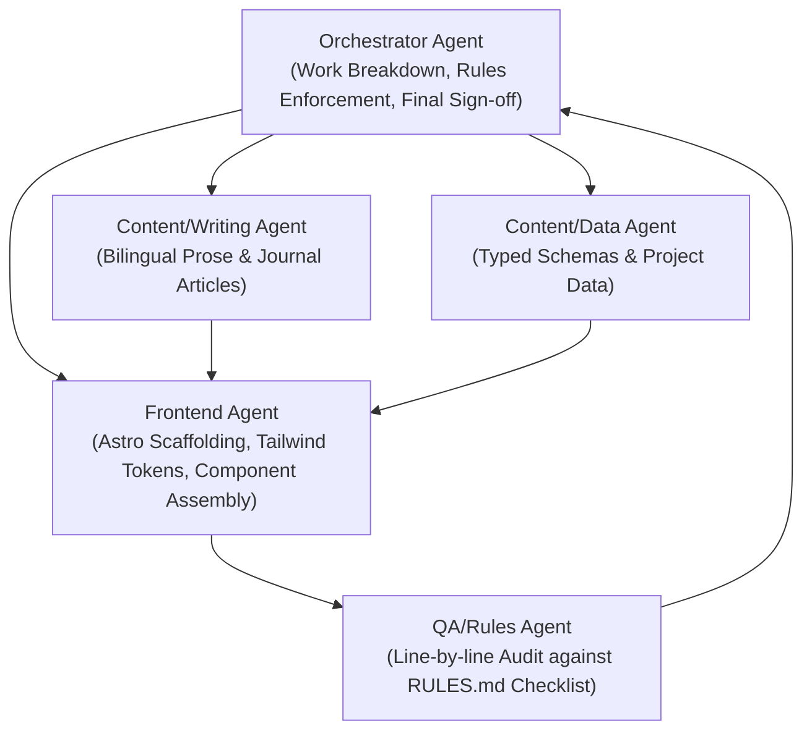

# Developer Portfolio & Engineering Journal

> **Gabriel Campos** — Systems Analysis & Development (*Análise e Desenvolvimento de Sistemas — ADS*) Student  
> Full-Stack Projects with Python/Django & TypeScript/Node.js • João Pessoa, PB, Brazil

An authentic, "learning in public" developer portfolio and technical journal built with **Astro** and **Tailwind CSS**. Built strictly adhering to the architectural and content-honesty principles defined in [`RULES.md`](./RULES.md), [`PROJECT.md`](./PROJECT.md), and [`AGENTS.md`](./AGENTS.md).

---

## 🌟 Core Philosophy

1. **Learn in Public:** Incomplete and in-progress work is showcased transparently rather than hidden behind a facade of false perfection.
2. **Avoid Over-Engineering (Simplicity First):** Minimal, working solutions before premature abstraction, microservices, or optimization.
3. **Radical Transparency:** Strict project status tags, zero fabricated metrics, no fake user counts, and honest disclosure of deployment states.
4. **Disciplined AI Tooling:** AI accelerates research and boilerplate, but all architecture, business rules, and constraints are human-reviewed and owned.

---

## 🗂️ Featured Projects Roadmap

The portfolio displays projects across different stages of completion, with prominent, color-coded status badges:

| Order | Project | True Status | Key Architecture & Context |
| :---: | :--- | :---: | :--- |
| **1** | **CineTrack** *(Flagship)* | `Functional / Near-Complete` | TV show tracking with Django + DRF + SQLite. **Architectural note:** stores only TVmaze show IDs to keep local DB lean and fetches show metadata on demand. |
| **2** | **API Backend — TypeScript** | `In Development` | RESTful API for auth and user management. Active benchmark evaluations between **Express vs. Fastify** and **Prisma vs. TypeORM**. |
| **3** | **Sistema de Reserva de Estúdios de Rádio** | `Planning / Data Modeling Stage` | Shared recording studio booking system originated from a **real radio station manager**. Entity-Relationship Model (DER) complete; no code yet. |
| **4** | **Estudos em C** | `Completed as Study Exercise` | Foundational roots in low-level memory (stack/heap, pointers, loops) and algorithm design. Labeled as foundational study, not a flagship product. |

---

## 🚀 Tech Stack

- **Framework:** [Astro v4](https://astro.build/) (Static Site Generation, zero-JS by default)
- **Styling:** [Tailwind CSS v3](https://tailwindcss.com/) with `@tailwindcss/typography`
- **Typing:** Strict TypeScript (`strictNullChecks`, `noImplicitAny`, strict tsconfig)
- **Internationalization:** Instant zero-FOUC bilingual support (Brazilian Portuguese `pt-BR` and English `en`)
- **Theme:** Dark / Light mode toggle with local storage persistence and system preference detection
- **Accessibility:** WCAG AA compliant contrast ratios (9:1 to 12:1), visible keyboard focus rings, and skip-to-content anchor

---

## 🤖 Multi-Agent Workflow

This project was built following the multi-agent coordination protocol specified in [`AGENTS.md`](./AGENTS.md):



---

## 🛠️ Getting Started

### Prerequisites
- Node.js `v18+` or `v20+` (tested on Node.js `v24.21.0`)
- npm `v9+` or `v10+`

### Installation & Development
```bash
# Clone the repository
git clone https://github.com/iGabrielCampos/Portfolio.git
cd Portfolio

# Install dependencies
npm install

# Start local development server (http://localhost:4321)
npm run dev

# Run type check and production static build
npm run build

# Preview production build locally
npm run preview
```

---

## 📄 License & Contact

- **Author:** Gabriel Campos
- **Email:** [gabriel.a.c.crispim2008@gmail.com](mailto:gabriel.a.c.crispim2008@gmail.com)
- **GitHub:** [@iGabrielCampos](https://github.com/iGabrielCampos)
- **Location:** João Pessoa, PB, Brazil (Open to remote internship opportunities)
